# Sikshyalaya  

Sikshyalaya is a **Loksewa exam preparation mobile application** that primarily focuses on **premium video lectures** to help aspirants prepare effectively. Users can **purchase expert-led video courses** covering essential Loksewa subjects, providing a structured and engaging way to learn at their own pace. The app also offers **mock tests, test reviews, and real-time news updates**, ensuring that users stay updated with the latest Public Service Commission (PSC) announcements. With a user-friendly interface and secure in-app payments using **Khalti**, Sikshyalaya makes high-quality educational content accessible to all aspirants.  

## **App Screenshots**  

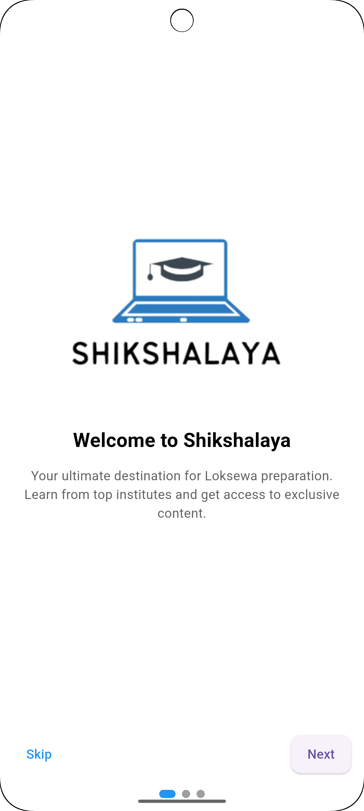  
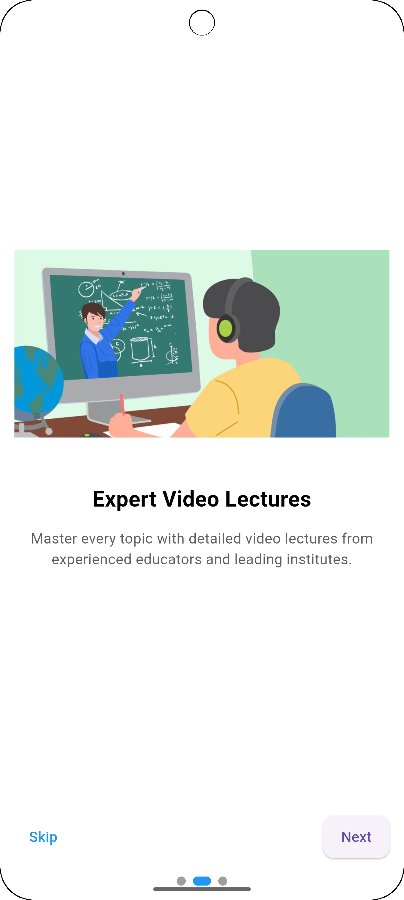  
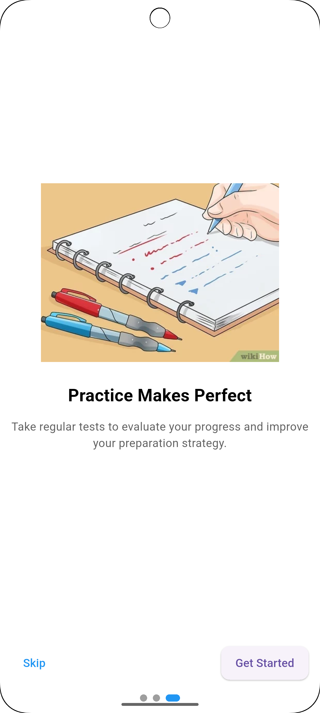  
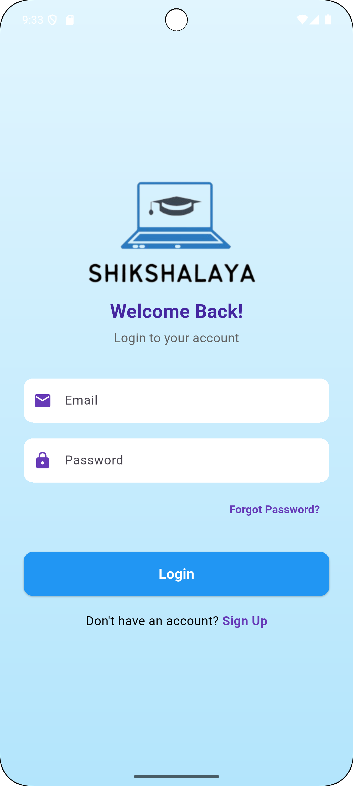  
  
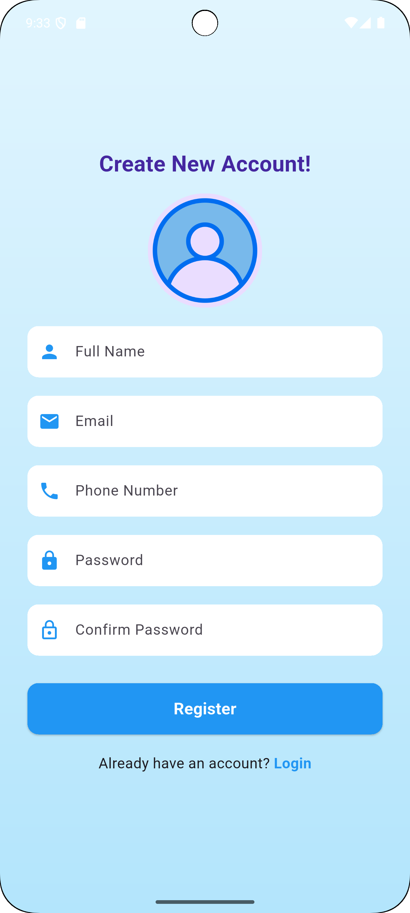  
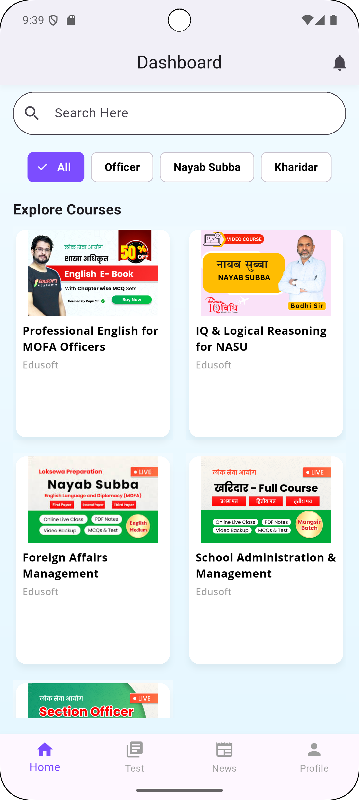  
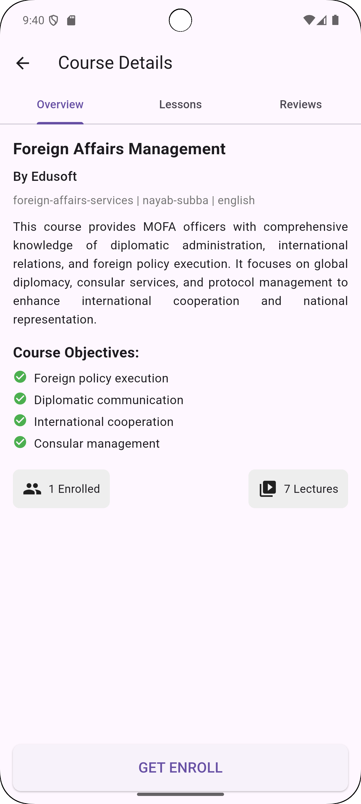  
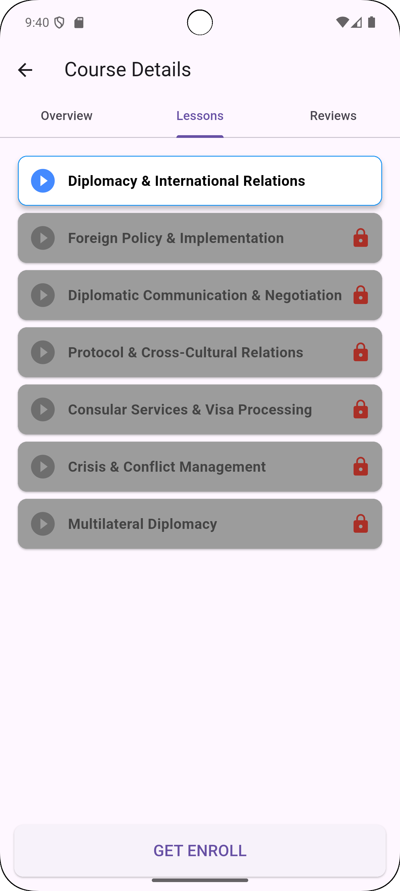  
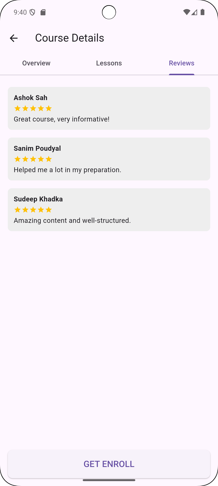  
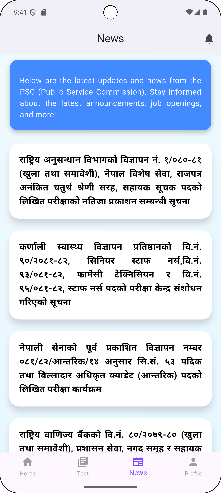  
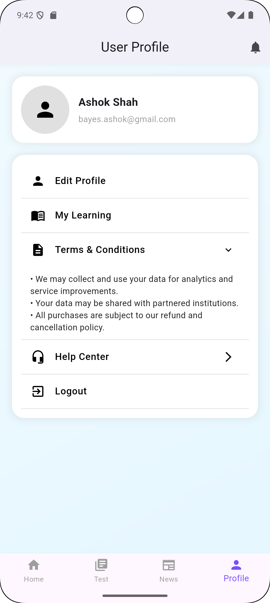  
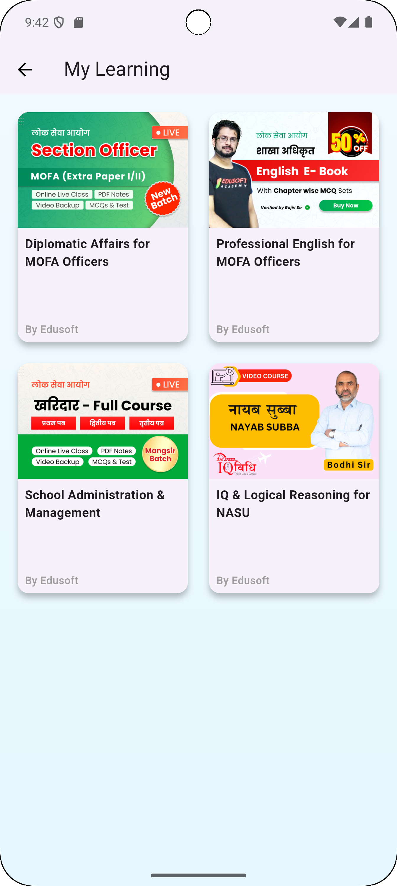  
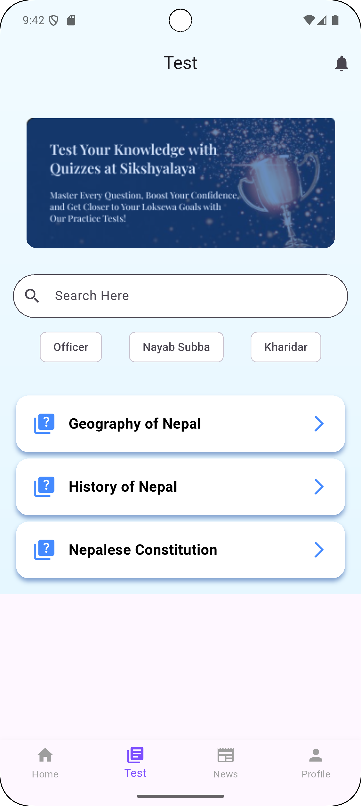  
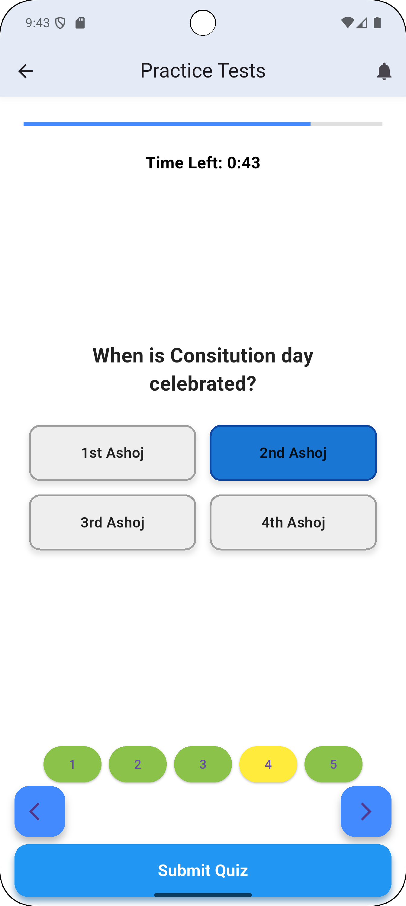  
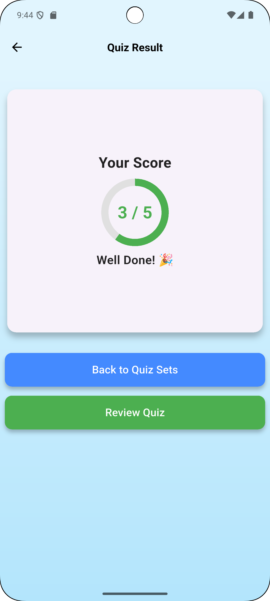  
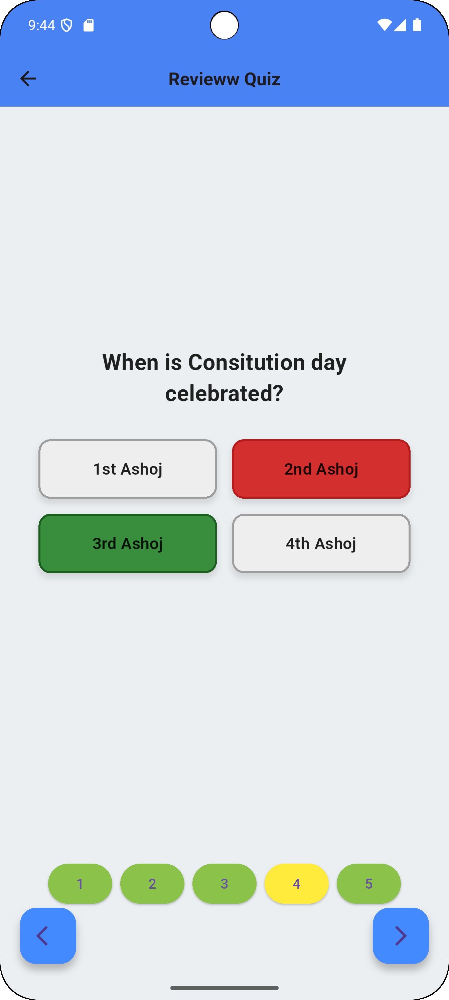  
